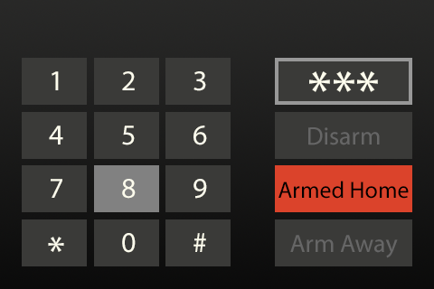

# mqtt-control-panel

A simple alarm control panel for Home Assistant's `manual_mqtt` alarm. Designed to run on a Raspberry Pi using an Adafruit 3.5" PiTFT.

Video of the control panel in action: <https://www.youtube.com/watch?v=2Lei8n_aSJI>

Display mockup:

# Hardware

 - Raspberry Pi Zero Wireless (other modern Pis will likely work fine)
 - [Adafruit PiTFT 3.5" display](https://www.adafruit.com/product/2441)

# Requirements

This project requires Python 2.7 with the following packages:

 - paho-mqtt
 - pygame
 - python-dotenv

# Configuration

Copy `.env.dist` to `.env` and update the values accordingly.
